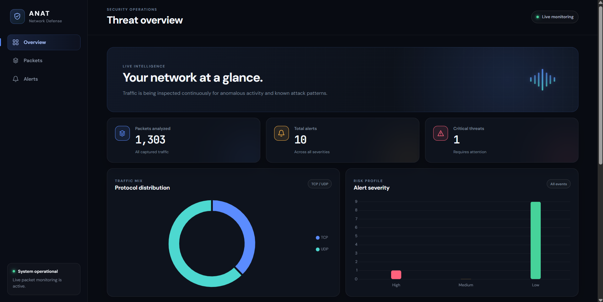

<div align="center">


# 🛡️ ANAT — AI Network Anomaly Tracker

**A lightweight, real-time Intrusion Detection System with a cyberpunk-inspired dashboard.**

[Features](#-features) · [Tech Stack](#️-tech-stack) · [Installation](#-installation) · [Dashboard](#-dashboard) · [Roadmap](#-roadmap)

</div>

---

## 🔍 Overview

ANAT (**AI Network Anomaly Tracker**) is a real-time Intrusion Detection System (IDS) built with Python, Flask, Scapy, and SQLite. It silently monitors your network interface, flags suspicious traffic patterns, and surfaces them through a live, auto-refreshing cyberpunk-themed dashboard — no bloated SIEM required.

Whether you're a student, security researcher, or homelab enthusiast, ANAT gives you instant visibility into what's happening on your network.

---

## ✨ Features

| Feature | Description |
|---|---|
| 📡 **Real-time Packet Capture** | Sniffs live traffic via Scapy on any available interface |
| 🚨 **Port Scan Detection** | Identifies hosts rapidly probing multiple ports |
| ⚠️ **Suspicious Port Alerts** | Flags connections to known dangerous/uncommon ports |
| 🌊 **Flood Detection** | Detects packet flooding and potential DoS activity |
| 📦 **Large Packet Detection** | Catches anomalously oversized packets |
| 🗄️ **SQLite Storage** | Lightweight persistent alert logging with SQLAlchemy ORM |
| 📊 **Interactive Dashboard** | Live charts via Chart.js with protocol distribution & severity |
| 🏆 **Top Source IP Leaderboard** | Ranks the most active/suspicious source IPs |
| 🔄 **Auto-Refresh Interface** | Dashboard updates automatically — no manual reload |
| 🎨 **Cyberpunk UI** | Dark-themed Bootstrap 5 interface built for clarity under pressure |

---

## 🛠️ Tech Stack

<div align="center">

| Layer | Technology |
|---|---|
| **Backend** | Python · Flask · Scapy |
| **Database** | SQLite · SQLAlchemy |
| **Frontend** | Bootstrap 5 · Chart.js · Vanilla JS |
| **Runtime** | Python 3.10+ |

</div>

---

## 📁 Project Structure

```
ANAT/
├── analyzer/          # Alert analysis logic
├── database/          # Database models & session management
├── scanner/           # Packet capture & detection engine
├── static/            # CSS, JavaScript assets
├── templates/         # Jinja2 HTML templates
├── instance/          # SQLite database instance (auto-generated)
├── app.py             # Flask application entrypoint
├── requirements.txt   # Python dependencies
├── test_sniffer.py    # Sniffer unit tests
└── README.md
```

---

## 🚀 Installation

### Prerequisites

- Python 3.10+
- Administrator / root privileges (required for raw packet capture)

### Steps

```bash
# 1. Clone the repository
git clone https://github.com/securitygeek15/ANAT.git
cd ANAT

# 2. Create and activate a virtual environment
python -m venv venv

# Windows
venv\Scripts\activate

# macOS / Linux
source venv/bin/activate

# 3. Install dependencies
pip install -r requirements.txt

# 4. Run the application (with elevated privileges for packet capture)
# Windows — run terminal as Administrator
python app.py

# macOS / Linux
sudo python app.py
```

Then open your browser and navigate to:

```
http://127.0.0.1:5000
```

---

## 📸 Dashboard

The ANAT dashboard provides a unified, real-time view of your network security posture.

> **Live monitoring panel — auto-refreshes every few seconds**



### Dashboard Panels

- **Alert Feed** — Timestamped log of all detected anomalies with severity tags
- **Protocol Distribution Chart** — Doughnut chart breaking down TCP / UDP / ICMP / Other traffic
- **Alert Severity Breakdown** — Bar chart showing Low / Medium / High / Critical counts
- **Top Source IPs** — Leaderboard of the most active source addresses
- **Packet Counter** — Rolling total of packets captured in the current session

### JSON API

- `GET /api/stats` - totals, protocol counts, severity counts, top sources, and recent alerts
- `GET /api/packets?limit=100` - latest packets as JSON
- `GET /api/alerts?limit=100` - latest alerts as JSON

---

## 📦 Dependencies

```
Flask==3.1.3
Flask-SQLAlchemy==3.1.1
scapy==2.6.1
SQLAlchemy==2.0.51
Werkzeug==3.1.8
Jinja2==3.1.6
```

Full list in [`requirements.txt`](./requirements.txt).

---

## ⚠️ Legal Disclaimer

> ANAT is intended for **educational and authorized security testing purposes only**.  
> Only run this tool on networks you own or have explicit permission to monitor.  
> Unauthorized packet capture may violate local laws and regulations.

---

## 🔮 Roadmap

- [ ] AI-powered anomaly detection (ML baseline model)
- [ ] CSV / JSON alert export
- [ ] Packet search and advanced filters
- [ ] Discord / Slack webhook alerts
- [ ] GeoIP attacker map
- [ ] Docker support
- [ ] Email alerting
- [ ] PCAP file replay for offline analysis

---

## 🤝 Contributing

Contributions are welcome! Feel free to open an issue or submit a pull request.

1. Fork the repository
2. Create your feature branch: `git checkout -b feature/my-feature`
3. Commit your changes: `git commit -m 'Add my feature'`
4. Push to the branch: `git push origin feature/my-feature`
5. Open a Pull Request

---

## 📄 License

This project is licensed under the **MIT License** — see the [LICENSE](./LICENSE) file for details.

---

<div align="center">

Made with 🛡️ by [securitygeek15](https://github.com/securitygeek15)

⭐ If ANAT helped you, consider giving it a star!

</div>
